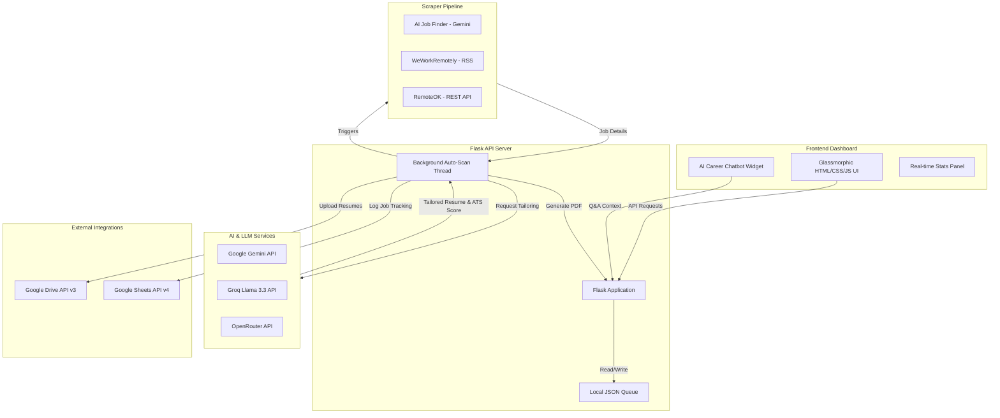

# 🤖 Resume Bot — AI-Powered Job Discovery & Resume Tailoring Platform (v2.0)

Resume Bot is a premium, modern, single-page dashboard application that automates the job search and application pipeline. It handles **job discovery** across multiple scrapers, **ATS-matching analysis**, **AI-powered resume tailoring**, and **cloud logging/storage** (Google Drive & Google Sheets).

---

## 🌟 Key Features

- **Multi-Source Job Aggregator**: Automatically aggregates remote developer jobs from:
  - **AI Job Finder**: Scrapes and discovers listings dynamically using the Google Gemini API.
  - **We Work Remotely**: Parses the official RSS feeds for remote programming jobs.
  - **RemoteOK**: Queries the RemoteOK JSON API.
- **AI Resume Tailoring**: Customizes your master resume (`master_resume.docx`) to match a specific job description, optimizing keyword density and flow.
- **ATS Score Engine**: Generates an estimated ATS compliance score (1-100) and displays missing keywords, tech stacks, and a job summary.
- **Automated Document Workflows**:
  - Automatically compiles tailored resumes into professional, print-ready PDFs.
  - Uploads generated PDFs to Google Drive, sets public view permissions, and retrieves shareable links.
  - Logs jobs to Google Sheets as "Due" or "Approved" to track application statuses.
- **Interactive AI Career Chatbot**: A floating chatbot assistant that uses your resume and active job search context to answer career questions, suggest interview prep, and explain job requirements.
- **Automated Daemon Scheduler**: Runs in the background to automatically find, tailor, and log new jobs hourly.

---

## 📐 System Architecture & Workflow

Here is how data flows through the application:



### End-to-End Workflow Steps
1. **Job Discovery**: The background thread (or manual triggers) runs the `JobAggregator` to pull matching listings from RSS, APIs, and AI search engines.
2. **Duplication Filter**: Scraped jobs are filtered against the local queue (`job_queue.json`) to prevent duplicates.
3. **AI Resume Tailoring**: The system calls the LLM (Gemini/Groq/OpenRouter) to cross-reference the job description with the user's master resume. The model produces:
   - ATS score (1-100)
   - Targeted keywords and tech stack
   - A tailored version of the resume in Markdown
4. **PDF compilation**: The tailored resume is compiled locally to `Generated_Resumes/` using `fpdf2`.
5. **Google Drive Integration**: The PDF is uploaded to a shared Google Drive folder.
6. **Google Sheets Logging**: The job title, company, URL, ATS score, and shareable Drive link are logged as "Due" in your tracking sheet.
7. **User Approval/Action**: From the frontend dashboard, you can browse, download, reject, or approve jobs. When you approve, it updates the sheet status to "Approved".

---

## 🛠️ Technology Stack & Rationale

| Layer | Technologies | Rationale |
| :--- | :--- | :--- |
| **Frontend UI** | HTML5, Vanilla CSS, JS (ES6+) | Highly performant, extremely customizable, zero build-step overhead, responsive across devices. Uses a sleek dark-mode glassmorphic interface with micro-animations. |
| **Backend Server** | Python 3.10+, Flask 3.0, Threading | Simple, lightweight, pythonic, and perfect for orchestrating scrapers, local queues, and Google Workspace libraries asynchronously. |
| **Document Engine** | `python-docx` & `fpdf2` | Parses the docx master resume and compiles formatted, print-ready PDF files dynamically. |
| **AI Layer (LLMs)** | Google Gemini 1.5 Flash, Groq (Llama 3.3 70B), OpenRouter | Multi-provider system. **Gemini** excels in scraping and parsing job descriptions. **Groq (Llama 3.3)** offers zero-cost, blazing-fast tailoring and chat. **OpenRouter** serves as a flexible fallback. |
| **Cloud Database** | Google Sheets API v4 | Serves as a transparent, free, user-accessible database for tracking jobs. |
| **Cloud Storage** | Google Drive API v3 | Keeps tailored PDF resumes organized in folders with public shareable links. |

---

## 🔑 Environment Secrets & Configuration

To prevent exposing sensitive credentials, API keys and configurations are decoupled from the code. The application automatically loads local configurations from a `.env` file (ignored by Git) and reads from environment variables in production.

### Local `.env` Configuration
Create a `.env` file in the root directory:

```env
# Selected AI Provider ("gemini", "groq", or "openrouter")
LLM_PROVIDER=groq

# API Keys
GEMINI_API_KEY=your_gemini_api_key_here
GROQ_API_KEY=your_groq_api_key_here
OPENROUTER_API_KEY=your_openrouter_api_key_here

# Google Spreadsheet Configuration
GOOGLE_SHEET_TITLE="Resume Task"
GOOGLE_SPREADSHEET_ID="your_google_spreadsheet_id_here"
DEFAULT_SHEET_TAB="your_name_tab_here"

# Google Drive Target Folder
RESUME_DRIVE_FOLDER="your_google_drive_folder_id_here"

# Search Keywords (comma-separated)
DEFAULT_KEYWORDS="React Developer, Python Developer, Full Stack Engineer"
```

---

## 🤖 Google Workspace Integration (Sheets & Drive)

The bot utilizes a Google Cloud Service Account to write to sheets and upload files.

### 1. Credentials Setup
1. Go to the [Google Cloud Console](https://console.cloud.google.com/).
2. Enable the **Google Drive API**, **Google Sheets API**, and **Google Docs API**.
3. Create a **Service Account** and download the credentials JSON key.
4. Rename this file to `credentials.json` and place it in the root directory.

### 2. Share Google Drive Folder & Spreadsheet
- Google Cloud Service Accounts operate under strict storage quotas (usually 0 bytes for free service accounts).
- **CRITICAL REQUIREMENT**: You **must** create your Google Drive folder and Spreadsheet using your personal Google Account, then share both files with the Service Account email address (found in your `credentials.json` under `client_email`) giving it **Editor** access.
- If not shared, the bot will gracefully log a warning, save the PDF files locally in `Generated_Resumes/`, and skip Google Sheets logging.

---

## 🚀 Local Installation & Execution

### 1. Clone & Install Dependencies
```bash
# Clone the repository
git clone <repository-url>
cd Resume_Bot

# Install required Python packages
pip install -r requirements.txt
```

### 2. Run the Application
```bash
# Start the Flask production-ready development server
python server.py
```
Open `http://127.0.0.1:5000` in your web browser to access the dashboard.

---

## 🧪 Running the Test Suite

The repository contains an automated end-to-end test script `test_all.py` that verifies all 13 critical API endpoints, including stats, AI tailoring, system info, scrapers, chatbot, settings updates, and PDF downloads.

To run the test suite:
```bash
python -X utf8 test_all.py
```

### What is verified:
1. `GET /api/stats` — Verification of queue count and logs integrity.
2. `GET /api/jobs` — Verification of jobs queue retrieval.
3. `GET /api/settings` — Verification of system configuration reads.
4. `POST /api/settings` — Verification of configuration writing.
5. `GET /api/system-info` — Verification of system architecture documentation.
6. `POST /api/scan` — Verification of scraper execution.
7. `POST /api/tailor` — Verification of AI resume tailoring and ATS scoring.
8. `POST /api/approve` — Verification of local PDF compilation and sheets tracking.
9. `POST /api/reject` — Verification of status updates.
10. `GET /api/download/pdf` — Verification of PDF document compilation.
11. `POST /api/chatbot` — Verification of AI career assistant context and response.
12. `POST /api/scheduler/toggle` — Verification of background daemon toggle.
13. `GET /` — Verification of frontend HTML/CSS/JS delivery.

---

## ☁️ Production Deployment

This project is fully structured for simple cloud deployment (e.g., on **Render**, **Railway**, or **PythonAnywhere**).

### Render Deployment Instructions
1. Connect your GitHub repository to Render as a **Web Service**.
2. Select **Python** as the runtime.
3. Set the build command:
   ```bash
   pip install -r requirements.txt
   ```
4. Set the start command:
   ```bash
   gunicorn server:app --bind 0.0.0.0:$PORT --workers 2 --threads 4 --timeout 120
   ```
5. Add the following **Environment Variables** in Render:
   - `LLM_PROVIDER` (e.g., `groq`)
   - `GEMINI_API_KEY`
   - `GROQ_API_KEY`
   - `GOOGLE_CREDENTIALS_B64`: Encode your `credentials.json` file in base64 (`cat credentials.json | base64` or on Windows: `[Convert]::ToBase64String([System.IO.File]::ReadAllBytes('credentials.json'))`). The app will automatically decode this at runtime and create `credentials.json`.
